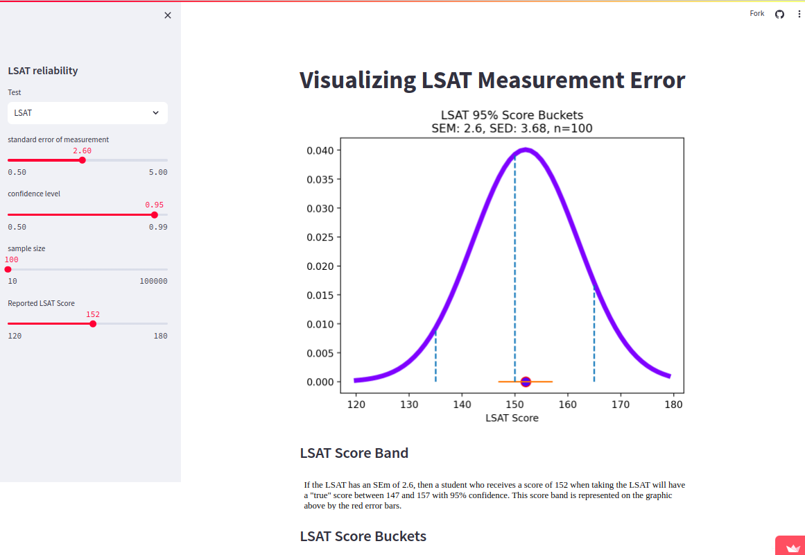

# Visualizing Test Measurement Error in Standardized Tests


This streamlit app demonstrates the relationship between the standard error of measurement of standardized test like the LSAT and the number of "buckets" that the test  can sort students into at the chosen confidence level.

I've striven to make the app self-documenting, but if you want a bit more information on the statistics involved, please see my [blog post](https://medium.com/@steindaavid/lsat-and-gmat-arent-reliable-tests-61a95386802d) 

If you just want to run this app without cloning the repo, you can do so at http://testbuckets.streamlit.app. Please wait a few moments for the app to wake up.

## To run locally:

```
#First, set up a virtual environment and activate it  

python3 -m venv test_buckets
source test_buckets/bin/activate

#Install requirements  
pip install -r requirements.txt

#run the app
streamlit run standardized_test_dashboard/main.py


```